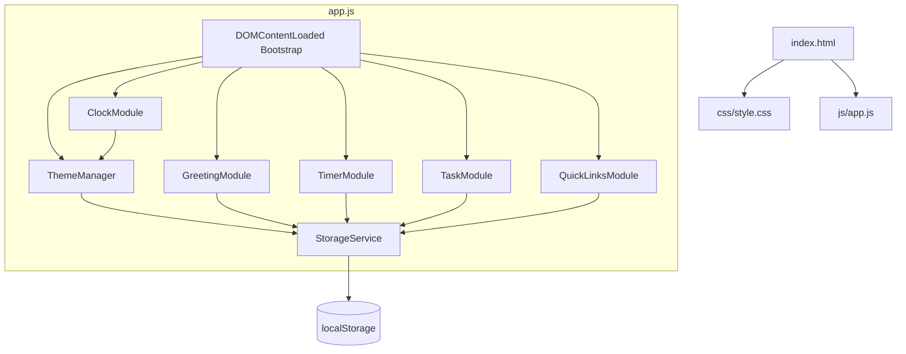

# Design Document: To-Do List Life Dashboard

## Overview

The To-Do List Life Dashboard is a client-side single-page application (SPA) delivered as three files: `index.html`, `css/style.css`, and `js/app.js`. It requires no build step, no server, and no internet connection after the initial page load (except for loading web fonts via Google Fonts CDN).

The application is structured around five self-contained logical modules that each manage a distinct concern:

| Module | Responsibility |
|---|---|
| `ClockModule` | Live time/date rendering, time-period detection |
| `GreetingModule` | Name input, salutation composition |
| `TimerModule` | Pomodoro countdown, audible alert |
| `TaskModule` | CRUD, duplicate detection, sorting |
| `QuickLinksModule` | Shortcut CRUD, URL validation |

All modules share a single `StorageService` abstraction over `localStorage` and a `ThemeManager` that applies both the light/dark toggle and time-of-day palette classes to the root `<html>` element.

### Design Rationale

- **No framework**: Vanilla JS modules using the IIFE/revealing-module pattern keep the code self-contained and avoid introducing a build pipeline.
- **Single source of truth**: Each feature owns its data slice in `localStorage` under a namespaced key. No shared mutable global state outside of module-internal variables.
- **Separation of concerns**: Pure logic functions (sorting, validation, time-period mapping) are isolated from DOM-manipulation functions, making them independently testable.

---

## Architecture



### Startup Sequence

The critical concern on startup is **FOUC prevention** for the theme. The `ThemeManager` must apply its data-attribute (`data-theme` and `data-period`) to `<html>` synchronously, before the browser paints. This is achieved with a tiny inline `<script>` tag placed in `<head>` — before any CSS — that reads from `localStorage` and sets the attributes immediately.

```
<head>
  <!-- FOUC guard — runs synchronously before first paint -->
  <script>
    (function() {
      var theme = localStorage.getItem('dashboard:theme') || 'light';
      document.documentElement.setAttribute('data-theme', theme);
    })();
  </script>
  <link rel="stylesheet" href="css/style.css" />
  ...
</head>
```

The time-of-day period is computed from `new Date()` inside the same guard, so the correct palette class is also applied before paint.

### Module Interaction Pattern

Modules communicate exclusively through direct function calls within `app.js` — no custom event bus is needed at this scale. When `ClockModule` detects a time-period boundary crossing, it calls `ThemeManager.applyPeriod(period)`. When `TaskModule` mutates the task array, it calls `StorageService.save(KEY, data)` directly.

---

## Components and Interfaces

### StorageService

Wraps `localStorage` with a try/catch guard so all modules degrade gracefully if storage is unavailable.

```js
StorageService = {
  save(key, value)     // JSON.stringify → setItem; throws on quota error (caller handles)
  load(key, fallback)  // getItem → JSON.parse; returns fallback on any error
  remove(key)          // removeItem; silent on error
}
```

### ThemeManager

Manages two orthogonal dimensions of theming applied to `document.documentElement`:

- `data-theme="light"|"dark"` — toggled by the user
- `data-period="morning"|"afternoon"|"evening"|"night"` — set by `ClockModule` on load and on period boundary

```js
ThemeManager = {
  init()                    // reads localStorage, applies both attributes, persists
  toggle()                  // flips data-theme, persists
  applyPeriod(period)       // sets data-period attribute
  getCurrentTheme()         // returns 'light' | 'dark'
}
```

CSS custom properties cascade from both attributes simultaneously:

```css
[data-theme="light"][data-period="morning"] { --accent: #F59E0B; --bg: #FFFBF0; }
[data-theme="dark"][data-period="morning"]  { --accent: #D97706; --bg: #1C1209; }
/* etc. */
```

### ClockModule

Owns a single `setInterval` at 1-second cadence.

```js
ClockModule = {
  init()             // starts interval, renders immediately
  _tick()            // private: gets Date, formats, detects period, updates DOM
  _formatTime(d)     // pure: returns "HH:MM:SS" string
  _formatDate(d)     // pure: returns "Weekday, DD Month YYYY" string
  _getPeriod(hour)   // pure: returns 'morning'|'afternoon'|'evening'|'night'
  _getGreeting(hour) // pure: returns 'Good Morning'|'Good Afternoon'|'Good Evening'
}
```

`_formatTime`, `_formatDate`, `_getPeriod`, and `_getGreeting` are pure functions with no side effects — they take a value and return a value.

### GreetingModule

```js
GreetingModule = {
  init()                  // loads name from storage, renders greeting, populates input
  saveName(rawInput)      // validates, trims, persists, updates DOM; returns {ok, error}
  _composeSalutation(greeting, name) // pure: combines salutation + name
}
```

### TimerModule

Owns a `setInterval` reference that is cleared on Stop/Reset. Uses `Web Audio API` for the completion beep if available.

```js
TimerModule = {
  init()               // loads duration from storage, renders initial state
  start()              // begins countdown
  stop()               // clears interval, pauses
  reset()              // clears interval, restores full duration display
  setDuration(minutes) // validates, persists, applies if not mid-session
  _tick()              // decrements remaining, checks for 00:00
  _updateButtons(state) // state: 'running'|'paused'|'complete'
  _notify()            // shows visible notification + optional audio beep
  _formatTimer(secs)   // pure: converts total seconds → "MM:SS"
}
```

### TaskModule

The task array lives entirely in memory during the session and is flushed to `localStorage` after every mutation.

```js
TaskModule = {
  init()                          // loads tasks, renders
  addTask(description)            // validates, checks duplicate, appends, saves, re-renders
  editTask(id, newDescription)    // validates, checks duplicate (excluding self), saves
  toggleTask(id)                  // flips completed flag, saves
  deleteTask(id)                  // removes by id, saves
  setSortOrder(order)             // 'default'|'status'|'alphabetical'; re-renders
  _validate(description)          // pure: returns {ok, error} — checks empty + length
  _isDuplicate(desc, tasks, excludeId) // pure: case-insensitive trimmed comparison
  _sortTasks(tasks, order)        // pure: returns new sorted array, does not mutate
  _render()                       // DOM update with current sort applied
}
```

### QuickLinksModule

```js
QuickLinksModule = {
  init()                       // loads links from storage, renders
  addLink(label, url)          // validates both fields, appends, saves, re-renders
  deleteLink(id)               // removes by id, saves
  _validateUrl(url)            // pure: checks non-empty + starts with http:// or https://
  _validateLabel(label)        // pure: checks non-empty + max 50 chars
  _render()                    // DOM update
}
```

---

## Data Models

All data is stored as JSON in `localStorage`. Each module owns a single key.

### localStorage Keys

| Key | Module | Type |
|---|---|---|
| `dashboard:theme` | ThemeManager | `"light" \| "dark"` |
| `dashboard:username` | GreetingModule | `string` (max 50 chars) |
| `dashboard:pomodoro-duration` | TimerModule | `number` (1–120) |
| `dashboard:tasks` | TaskModule | `Task[]` |
| `dashboard:links` | QuickLinksModule | `Link[]` |

### Task Object

```js
{
  id: string,          // UUID v4 or Date.now().toString() — unique, immutable
  description: string, // 1–200 chars, trimmed
  completed: boolean,
  insertionIndex: number // monotonically increasing integer for stable sort fallback
}
```

### Link Object

```js
{
  id: string,   // UUID v4 or Date.now().toString()
  label: string, // 1–50 chars
  url: string    // valid http:// or https:// URL, max 2048 chars
}
```

### Time Period Mapping

```js
function getPeriod(hour) {
  if (hour >= 5  && hour <= 11) return 'morning';
  if (hour >= 12 && hour <= 17) return 'afternoon';
  if (hour >= 18 && hour <= 20) return 'evening';
  return 'night'; // 21–23 and 00–04
}
```

### Greeting Salutation Mapping

```js
function getGreeting(hour) {
  if (hour >= 5  && hour <= 11) return 'Good Morning';
  if (hour >= 12 && hour <= 17) return 'Good Afternoon';
  return 'Good Evening'; // 18–23 and 00–04
}
```

---

## Correctness Properties

*A property is a characteristic or behavior that should hold true across all valid executions of a system — essentially, a formal statement about what the system should do. Properties serve as the bridge between human-readable specifications and machine-verifiable correctness guarantees.*

### Property 1: Clock time formatting zero-pads all components

*For any* valid `Date` object with any combination of hours (0–23), minutes (0–59), and seconds (0–59), `_formatTime(d)` SHALL return a string matching the pattern `HH:MM:SS` where each component is exactly two digits.

**Validates: Requirements 1.1**

---

### Property 2: Clock date formatting contains all required components

*For any* valid `Date` object, `_formatDate(d)` SHALL return a string that contains the full weekday name, the numeric day, the full month name, and the four-digit year, in that order.

**Validates: Requirements 1.2**

---

### Property 3: Time-period mapping is total and exhaustive

*For any* integer hour in the range 0–23, `_getPeriod(hour)` SHALL return exactly one of `'morning'`, `'afternoon'`, `'evening'`, or `'night'`, with no hour left unclassified and no hour classified into more than one period.

**Validates: Requirements 2.1, 2.2, 2.3, 2.4, 11.1, 11.2, 11.3, 11.4**

---

### Property 4: Greeting salutation composition with name

*For any* greeting string and any name string, `_composeSalutation(greeting, name)` SHALL produce a string containing the greeting and the (up to 50 character) name separated by `", "` when the name is non-empty, and SHALL return just the greeting when the name is empty or whitespace-only.

**Validates: Requirements 2.5, 2.6, 2.7**

---

### Property 5: Task description validation rejects empty and over-length inputs

*For any* string that is either empty, whitespace-only, or longer than 200 characters, `_validate(description)` SHALL return `{ ok: false }`. *For any* string with at least one non-whitespace character and a trimmed length ≤ 200, `_validate(description)` SHALL return `{ ok: true }`.

**Validates: Requirements 6.2, 6.3, 6.4, 6.7, 6.8**

---

### Property 6: Duplicate detection is case-insensitive and trim-invariant

*For any* task description and any existing task list, `_isDuplicate(desc, tasks, excludeId)` SHALL return `true` if and only if there exists a task in the list (not excluded by `excludeId`) whose trimmed, lowercased description equals the trimmed, lowercased input description.

**Validates: Requirements 7.1, 7.2, 7.3, 7.4**

---

### Property 7: Sort order produces stable, non-destructive output

*For any* array of tasks and any Sort_Order value, `_sortTasks(tasks, order)` SHALL return a new array (not mutate the input) containing exactly the same task IDs as the input, with:
- `'default'`: order equivalent to insertion index ascending
- `'status'`: all incomplete tasks before all complete tasks, each group stable by insertion index
- `'alphabetical'`: ascending case-insensitive description order, ties broken by insertion index

**Validates: Requirements 8.2, 8.3, 8.4, 8.5**

---

### Property 8: Timer formatting round-trips seconds to MM:SS

*For any* integer number of seconds in the range 0–7200 (0 to 120 minutes), `_formatTimer(secs)` SHALL return a string matching `MM:SS` where MM is zero-padded and SS is zero-padded, and `parseInt(MM) * 60 + parseInt(SS)` equals the original input.

**Validates: Requirements 4.1, 4.5**

---

### Property 9: URL validation accepts only http/https and rejects others

*For any* string, `_validateUrl(url)` SHALL return `true` if and only if the string is non-empty and begins with `"http://"` or `"https://"`. All other strings (empty, `ftp://`, `//`, relative paths, plain hostnames) SHALL return `false`.

**Validates: Requirements 9.2, 9.4**

---

### Property 10: Task addition grows the list and stores the task

*For any* task list and any valid, non-duplicate task description, after `addTask(description)` succeeds, the task list SHALL contain exactly one more task than before, and the new task's trimmed description SHALL be present in the resulting list.

**Validates: Requirements 6.2, 6.11**

---

## Error Handling

### localStorage Failures

Every `StorageService.save()` and `StorageService.load()` call is wrapped in `try/catch`. On load failure, the module renders its empty/default state and optionally shows a non-blocking banner (Requirements 6.13, 9.8). On save failure, the UI reflects the mutation but shows a non-blocking warning (Requirement 9.9).

### Timer Edge Cases

- `start()` checks remaining time > 0 before setting interval (Requirement 4.10).
- `setDuration()` validates the value is an integer in [1, 120] before accepting it (Requirement 5.5).
- If `Web Audio API` is unavailable, the audible alert is silently skipped; the visible notification still fires (Requirement 4.7).

### Clock Failure

`_tick()` wraps `new Date()` in a try/catch. On failure, it renders `--:--:--` and `Date unavailable` (Requirement 1.5).

### Input Validation Messages

All inline validation messages are rendered as `<span role="alert">` elements adjacent to the relevant input, so screen readers announce them. Messages are cleared on the next valid submission attempt.

